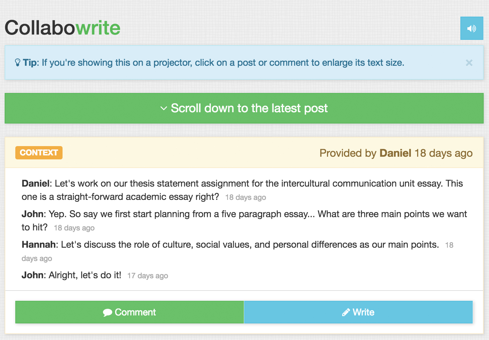

#**Collabowrite**

Live link: **https://collabowriteit.herokuapp.com/**

##Screenshots of **Collabowrite**

##Summary

"Collabowrite" is an app that allows people to work together real-time on sentence/paragrph-level writing for personal, professional, academic or business-related purposes. Users are able to create a project by providing of a context for the writing (and optionally an initial version to work from), then invite others to contribute by providing feedback, revisions, and/or new proposals. 

"Collabowrite" keeps track of the development and progression of the project by chronologically organizing proposals for the writing, revisions, and discussions, and allows for optimized group work by highlighting any changes or additions from one version to another and displaying and notifying users of any new contributions real-time as they work together on the project.

The main features include the following:

(1) Real-time updates and notifications of new posts and comments

(2) A Mobile responsive interface to allow users to work from smartphones and tablets

(3) An on-click text-enlarging feature of posts and comments to make projects presentation/classroom-friendly.

(4) Easy account-free set-up enabled using randomly generated unique project access codes 

##Technology

"Collabowrite" is a full-stack express application using React.js and Node.js for its front-end and back-end framework respectively and MongoDB for its database. All posts, forms, and comments are composed of components, which communicate data with each another via props and state. Axios is used to make calls to the REST API to save and display post Mongoose object data stored in a MongoDB database hosted on Mlab. The app uses Pusher (https://pusher.com) for real-time event triggering to display new posts and comments to all users in session. Lastly, Webpack and style loaders have been used to generate a bundle.js that combines all of the front-end javascript files and CSS stylesheets into one javascript file. 

Live link: **https://collabowriteit.herokuapp.com/**

For any further questions, contact me at **tswpaik@gmail.com**.

Cheers!